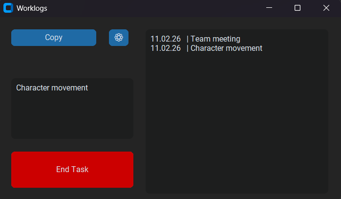
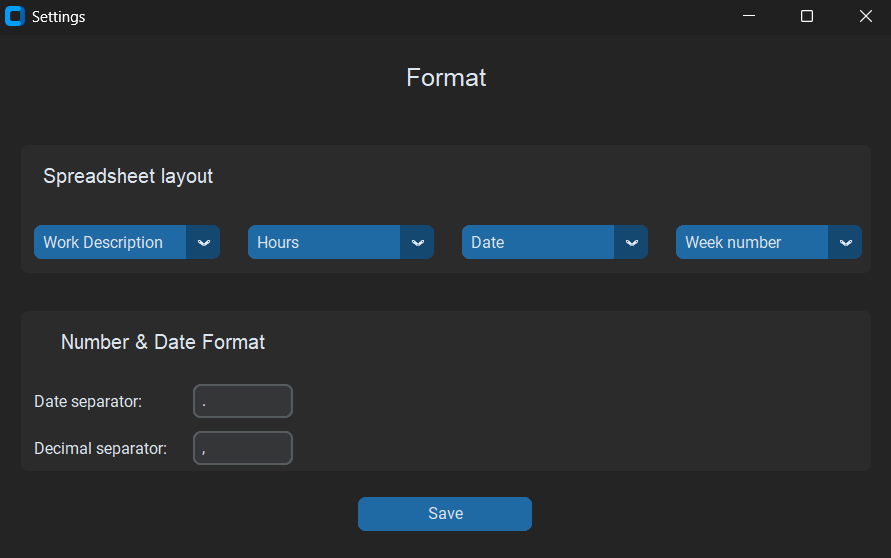
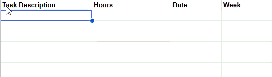

# WorklogsGameLab
A tool to help write worklogs for GameLab at Nord University.

Worklogs are often done at the end of the day, which can lead to guessing the time spent on tasks. With this tool, simply write down your task and click **Start** - the application will take care of tracking the hours for you.

The settings page allows you to use multiple worklog formats.

At the end of the day, click the **Copy** button and paste everything into your worklog spreadsheet.

